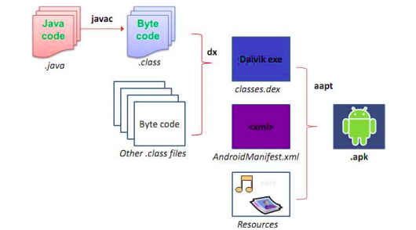

# Android Package Kit \(APK\)

Para simplificar o entendimento podemos dizer que um APK nada mais é do que um conjunto de códigos .class compilados em .dex, o manifesto no qual há especificações sobre o aplicativo em geral, e por fim recursos, que são diretórios contendo strings, layouts, menus e tudo que não era código Java antes da compilação.

Um APK contém uma variedade de arquivos e recursos, mas normalmente contém certos diretórios e arquivos. O Google Developers, site oficial para desenvolvedores Android, especifica todos estes arquivos. Porém, serão citados apenas os mais importantes para o contexto deste manual: 

a. **AndroidManifest.xml**: este documento é utilizado para informações organizacionais, contendo 27 tipos pré-definidos de elementos, dentre os quais pode-se especificar componentes da aplicação, permissões necessárias pela aplicação para interagir com outras, bibliotecas necessárias, filtros para intents e broadcasts; 

b. **META-INF:** é um diretório que contém meta informações necessárias para assinatura da aplicação. Alguns arquivos importantes são: MANIFEST.MF \(o manifesto em formato de metadado\), CERT.RSA \(o certificado da aplicação\), CERT.SF \(contém o sumário SHA-1 correspondente ao manifesto\); 

c. **lib**: um diretório que contém código compilado especificamente para um processador, e é dividido em diretórios de mesmo nome da arquitetura - armeabi, armeabi-v7a, x86 e mips; 

d. **assets**: um diretório contendo arquivos que serão compactados junto com a aplicação; 

e. **res**: um diretório que contém recursos que não são pré compilados. Estes incluem layouts, valores \(strings, ids, cores\) e drawables, que são arquivos 12 de desenho. A classe R armazena todos os IDs de todos os recursos desta pasta, uma vez definidos em seu XML \(string.xml, layout.xml e afins\); 

f. **proguard-project.txt**: arquivo de configuração do proguard, que serve para ofuscação de código fonte, com o objetivo de evitar com que alguém leia este código.

