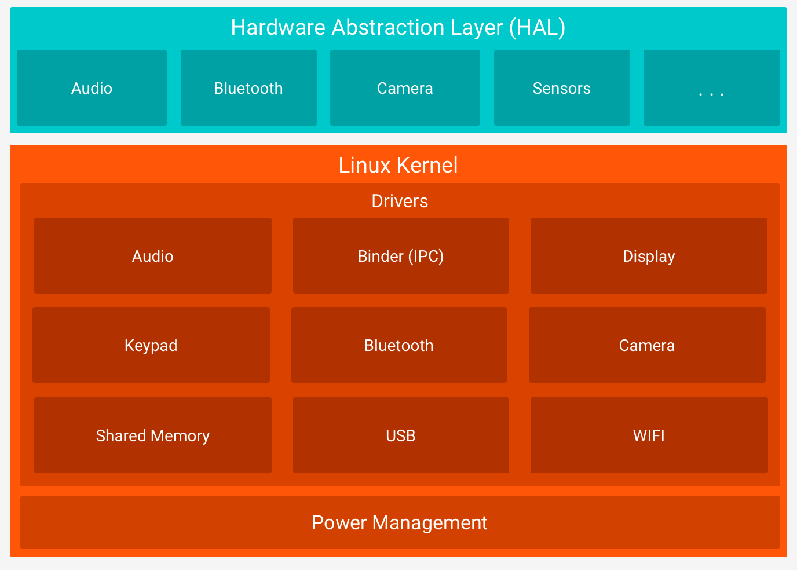

# Arquitetura Android

O Android é uma pilha de software com base em Linux de código aberto criada para diversos dispositivos e fatores de forma. O diagrama a seguir mostra a maioria dos componentes da plataforma Android.

### Kernel do Linux 

A fundação da plataforma Android é o kernel do linux. Por exemplo: o Android Runtime \(ART\) confia no kernel do Linux para cobrir funcionalidades como encadeamento e gerenciamento de memória de baixo nível.

Usar um kernel do Linux permite que o Android aproveite os recursos de segurança principais e que os fabricantes dos dispositivos desenvolvam drivers de hardware para um kernel conhecido.

### Camada de abstração de hardware \(HAL\) 

A camada de abstração de hardware \(HAL\) fornece interfaces padrão que expõem as capacidades de hardware do dispositivo para a estrutura da Java API de maior nível. A HAL consiste em módulos de biblioteca, que implementam uma interface para um tipo específico de componente de hardware, como o módulo de câmera ou Bluetooth. Quando uma Framework API faz uma chamada para acessar o hardware do dispositivo, o sistema Android carrega o módulo da biblioteca para este componente de hardware.

### Android Runtime 

Para dispositivos com Android versão 5.0 \(API nível 21\) ou mais recente, cada aplicativo executa o próprio processo com uma instância própria do Android Runtime \(ART\). O ART é projetado para executar várias máquinas virtuais em dispositivos de baixa memória executando arquivos DEX, um formato de bytecode projetado especialmente para Android, otimizado para oferecer consumo mínimo de memória. Construa cadeias de ferramentas, como Jack, e compile fontes Java em bytecodes DEX, que podem ser executadas na plataforma Android.

Alguns dos recursos principais de ART são:

* Compilação "ahead-of-time" \(AOT\) e "just-in-time" \(JIT\)
* Coleta de lixo \(GC\) otimizada
* No Android 9 \(nível de API 28\) ou superior, a conversão dos arquivos de formato Dalvik Executable \(DEX\) de um pacote de aplicativos usa um código de máquina mais compacto.
* Melhor compatibilidade de depuração, inclusive um criador de perfil de exemplo, exceções de diagnóstico detalhadas e geração de relatórios de erros, além da capacidade de definir pontos de controle para monitorar campos específicos

Antes do Android versão 5.0 \(API nível 21\), o Dalvik era o tempo de execução do Android. Se o seu aplicativo executa o ART bem, deve funcionar no Dalvik também, mas talvez não vice-versa.

O Android também contém um conjunto das principais bibliotecas de tempo de execução que fornecem a maioria da funcionalidade da linguagem de programação Java, inclusive alguns recursos de linguagem Java 8 que a biblioteca da API Java usa.

### Bibliotecas nativas C / C ++ 

Vários componentes e serviços principais do sistema Android, como ART e HAL, são implementados por código nativo que exige bibliotecas nativas programadas em C e C++. A plataforma Android fornece as Java Framework APIs para expor a funcionalidade de algumas dessas bibliotecas nativas aos aplicativos. Por exemplo, é possível acessar OpenGL ES pela Java OpenGL API da estrutura do Android para adicionar a capacidade de desenhar e manipular gráficos 2D e 3D no seu aplicativo.

Se estiver desenvolvendo um aplicativo que exige código C ou C++, você pode usar o Android NDK para acessar algumas dessas bibliotecas de plataforma nativa diretamente do seu código nativo.

### Estrutura da Java API 

O conjunto completo de recursos do SO Android está disponível pelas APIs programadas na linguagem Java. Essas APIs formam os blocos de programação que você precisa para criar os aplicativos Android simplificando a reutilização de componentes e serviços de sistema modulares e principais, inclusive:

* Um sistema de visualização rico e extensivo útil para programar a IU de um aplicativo, com listas, grades, caixas de texto, botões e até mesmo um navegador da web incorporado
* Um gerenciador de recursos, fornecendo acesso a recursos sem código como strings localizadas, gráficos e arquivos de layout
* Um gerenciador de notificação que permite que todos os aplicativos exibam alertas personalizados na barra de status
* Um gerenciador de atividade que gerencia o ciclo de vida dos aplicativos e fornece uma pilha de navegação inversa
* Provedores de conteúdo que permite que aplicativos acessem dados de outros aplicativos, como o aplicativo Contatos, ou compartilhem os próprios dados

Os desenvolvedores têm acesso completo às mesmas Framework APIs que os aplicativos do sistema Android usam.

### Aplicativos do sistema 

O Android vem com um conjunto de aplicativos principais para e-mail, envio de SMS, calendários, navegador de internet, contatos etc. Os aplicativos inclusos na plataforma não têm status especial entre os aplicativos que o usuário opta por instalar. Portanto, um aplicativo terceirizado pode se tornar o navegador da Web, o aplicativo de envio de SMS ou até mesmo o teclado padrão do usuário \(existem algumas exceções, como o aplicativo Configurações do sistema\).

Os aplicativos do sistema funcionam como aplicativos para os usuários e fornecem capacidades principais que os desenvolvedores podem acessar pelos próprios aplicativos. Por exemplo: se o seu aplicativo quiser enviar uma mensagem SMS, não é necessário programar essa funcionalidade — é possível invocar o aplicativo de SMS que já está instalado para enviar uma mensagem ao destinatário que você especificar.

