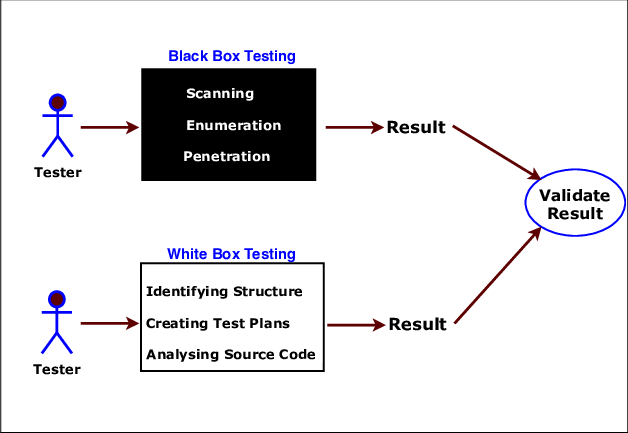

# Black-Box vs White-Box

Sobre tipos de testes podemos definir basicamente dois tipos de análises quando vamos falamos de códigos em geral, a chamada white-box testing que é quando o código fonte é aberto para o teste, ou seja, podemos ver todas as funções, métodos, variáveis, basicamente o que o desenvolvedor ver, todo o código fonte. Já o outro tipo de teste é o chamado black-box testing, no qual o testador não tem acesso ao código fonte. No Android, a diferença entre os testes não é tão grande, visto que a maioria dos aplicativos podem ser descompilados para códigos similares ao original. Logo, utilizamos um misto de testes white-box e black-box, que é geralmente a melhor abordagem. 

Para análise de aplicativos Android existem dois tipos de ferramentas. Elas podem ser de Análise Estática ou Análise Dinâmica, sendo a primeira executada quando temos acesso ao APK e executamos as ferramentas sem que o aplicativo esteja em execução, verificando potenciais problemas que podem ter quando o aplicativo for executado. Já no segundo caso, a ferramenta ajuda na análise enquanto o aplicativo está sendo executado, monitorando desde mudanças em tempo real à arquivos do sistema até comunicações ponto-a-ponto. 

Um pentest \(penetration test\), ou teste de penetração no português, é um método de avaliar a segurança de um sistema simulando ataques como se o testador fosse uma espécie de usuário malicioso e objetiva-se descobrir brechas para ataques antes que sejam descobertos por outros hackers, para assim efetivar o necessário e eliminar estes problemas

