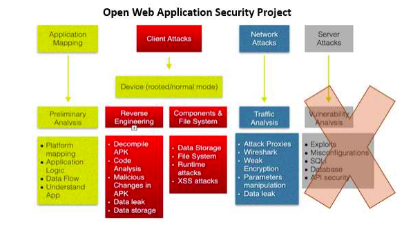

# Metodologia

Com base na imagem acima pode-se observar todos os testes que podem ser feitos para detectar as top 10 vulnerabilidades. Como a aplicação é instalada inteiramente no smartphone do cliente retiramos a parte de Server Attacks \(Ataques ao Servidor\), pois o mesmo estrapola o escopo do manual, pois estamos focados nos dados que saem dele.

## **Análise Preliminar** 

Primeiramente há um mapeamento com diversas análises manuais, de forma que o testador irá instalar e utilizar o aplicativo recolhendo quaisquer informações possíveis como a lógica da aplicação, qual o gênero da aplicação \(negócios, viagens, banco, etc\), funcionalidades, APIs usadas \(se identificáveis\), fluxo de dados, fluxo de telas e se o aplicativo é nativo, híbrido ou web.

## **Engenharia reversa** 

Um arquivo .apk nada mais é do que um conjunto de arquivos compilados que contém o código da aplicação em formato .dex. Porém, os arquivos .dex apenas são entendidos por máquinas, o que nos leva a precisar trabalhar com eles de outra forma com intuito de recuperar o código original. Para isso, utilizamos ferramentas como a Apktool que transformarão .dex em .smali\(um intermediário entre o código que a máquina entende e o que os humanos entendem, facilitando assim sua compreensão, num processo chamado de baksmaling\). Entretanto, o código .smali não pode ser convertido em .class pois parte da informação é perdida, então outra opção é tentar recuperar os arquivos .class por meio da conversão de .dex para .jar, utilizando para isso ferramentas como dex2jar ou enjarify. Para visualizar e abrir todos os códigos de uma só vez, utilizaremos ferramentas de leitura de arquivos .jar como JDGUI, JADX, que suportam até a versão do Java 7. Para o Java 8, pode-se usar descompiladores mais recentes também como Procyon e CRF, porém os mesmos têm interfaces gráficas à parte, por meio de extensões. O Bytecode Viewer é open source e utiliza destes descompiladores de arquivos .jar já citados e oferece uma interface gráfica para facilitar a visualização por meio do usuário. Com isso pode-se observar se a aplicação está bem ofuscada ou está aberta, ou seja, se quando houver o processo de engenharia reversa é possível produzir um código-fonte tão bom como o original ou um código similar, porém não tão legível, a depender das funcionalidades do ofuscador utilizado no processo de compilação. O Proguard, ofuscador padrão do Android, gratuito e open source, tem funcionalidades como eliminação de código não utilizado, remoção de informação de logs e depuração e otimização de código, contudo não oferece encriptação de strings estáticas, alteração de fluxo e outras funcionalidades que ofuscadores pagos oferecem. Com o código resultante em mãos, seja ele ofuscado ou não, é possível analisa-lo em busca de APIs utilizadas, funcionalidades estranhas, controles de checksum, controles de debug, aceitação de certificados, confirmar hipóteses da análise preliminar e procurar por strings ou palavras-chave como as funções hash criptográficas SHA256, SHA ou MD5.

## **Componentes e Arquivos do Sistema**

Esta parte está interligada com a de engenharia reversa, pois as duas dependem da análise do código. É necessário que se use o aplicativo por um tempo para que dados de armazenamento apareçam em bancos de dados como SQLite \(database oficial do Android\), Realm \(alternativa ao SQLite\) ou outras formas de armazenamento como Shared Preferences, uma estrutura em XML que armazena um par \(chave, valor\) e forma persistente no sistema. Além disso, é essencial checar as permissões do aplicativo no arquivo AndroidManifest.xml \(caso não se tenha feito na fase anterior\). 

Este passo requer a disponibilidade de um smartphone que sofreu processo de root e assim obter total acesso como administrador do sistema, acessando pastas onde ficam o cartão de memória como /sdcard/ e /sdcard1/ além da pasta da aplicação que contém as Shared Preferences, que fica no diretório /data/data//shared\_prefs/ ou bancos de dados. Para os passos anteriores, deve-se usar o adb \(Android Device Bridge\), que é uma ferramenta que já vem com a SDK do Android e se comunica com um dispositivo Android conectado via USB ou emulador. Com isso, sabe-se se há informações sensíveis espalhadas por arquivos, logs, além de saber se é possível fazer SQL injection ou SQLi, um tipo de ataque no qual a aplicação não checa o input ou entrada de dados de forma apropriada, e isso possibilita a manipulação de uma consulta no banco de dados SQL. 

Outro ponto para testar nessa parte são os content providers, no português, provedores de conteúdo. Eles são declarados no arquivo de manifesto do aplicativo e como dito anteriormente, permite a aplicação acessar dados de outra aplicação, assim deixando-a muitas vezes vulnerável a ataques. Para esta tarefa, é utilizado tanto o ADB de modo manual, ou o Drozer de modo automático, que facilita bastante o trabalho de identificação de vetores de ataque.

## **Ataques de Rede** 

Aqui são identificadas vulnerabilidades de rede do lado cliente, que é o que mais interessa, avaliando o tráfego que sai do aparelho para o servidor. Com isso, pode-se identificar problemas com SSL, criptografia, autorização de tokens, uso de geradores randômicos e outros ataques de rede se considerarmos aplicações totalmente em Web adaptadas para mobile, o que não é o foco do trabalho, já que estamos falando de código nativo Java. Neste passo basicamente coloca-se um Network Sniffer como o Wireshark ou um proxy como Burp Suite, Charles Proxy, ou OWASP ZAP e todo o tráfego HTTP\(S\) é redirecionado por este proxy, que estará rodando na máquina que faz os testes.

